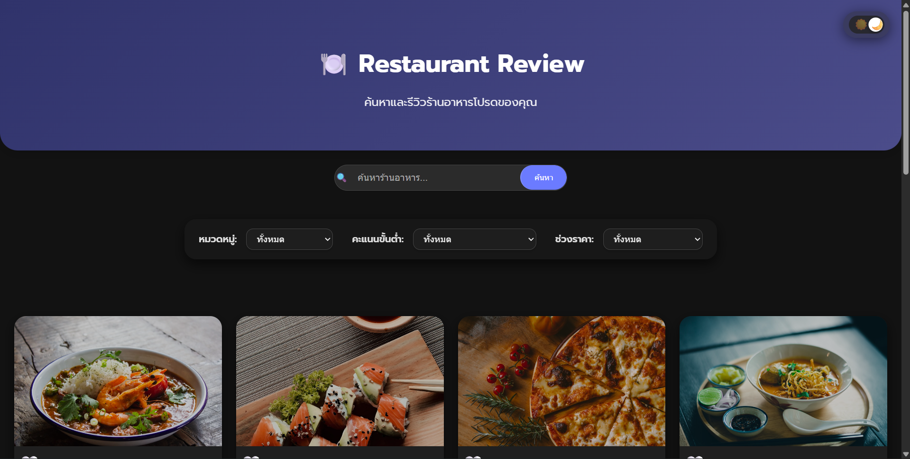

# Restaurant Review Website

## รายละเอียดโปรเจค
โปรเจกต์นี้เป็น **ระบบรีวิวร้านอาหาร** ที่ให้ผู้ใช้สามารถค้นหาร้านอาหาร 🏪
ดูคะแนนรีวิวจากผู้ใช้คนอื่น ⭐ และเขียนรีวิวของตนเอง ✍️ ได้แบบเรียลไทม์
รองรับโหมดมืด–สว่าง 🌙☀️ พร้อมการกรองร้านและค้นหาด้วยคีย์เวิร์ด 🔍

## เทคโนโลยีที่ใช้
- Frontend: React 18 + Vite
- Backend: Node.js + Express
- Database: JSON File Storage

## Features ที่ทำได้
### Required Features (70 คะแนน)
- [x] แสดงรายการร้านอาหาร
- [x] ค้นหาร้าน
- [x] กรองตามหมวด/rating/ราคา
- [x] ดูรายละเอียดร้าน
- [x] เพิ่มรีวิว
- [x] Validation
- [x] อัพเดท rating อัตโนมัติ

### Bonus Features (ถ้ามี)
- [ ] Sort restaurants
- [ ] Responsive design
- [ ] Animations

## วิธีติดตั้งและรัน

### Backend
\`\`\`bash
cd backend
npm install
cp .env.example .env
npm run dev
\`\`\`

### Frontend
\`\`\`bash
cd frontend
npm install
npm run dev
\`\`\`

## API Endpoints
- GET `/api/restaurants` - ดึงรายการร้านทั้งหมด
- GET `/api/restaurants/:id` - ดึงร้านตาม ID
- POST `/api/reviews` - เพิ่มรีวิว
- GET `/api/stats` - ดึงสถิติ

## Screenshots
### หน้าแรก
!

### รายละเอียดร้าน

### ฟอร์มรีวิว

## ผู้พัฒนา
- นาย ชนสรณ์ บุตรถา
- 67543210025-2
- chanasorn_bu67@live.rmutl.ac.th

## License
MIT License